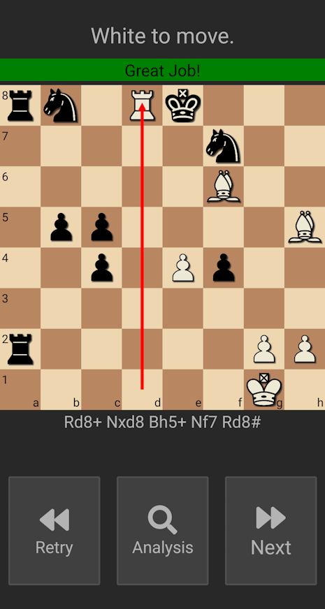

# Tactics Trainer

 A React Native chess app desinged to improve your ability to identify and execute chess tactics.

#### Basics
* An easy to use tactics trainer made with the help of [chess.js](https://github.com/jhlywa/chess.js)
* Problems come from Uwe Auserwald and can be found [here](http://gorgonian.weebly.com/pgn.html)
* To move a piece, simply press on the piece and then press a second time where you want to move it.
* Pressing the **Show Hint** button once will show which piece needs to moved to continue.
* Pressing the **Show Hint** button a second time will move the piece to the correct square.
* The **View Solution** button will play out the full solution.
* After a solving or viewing the solution, you can **retry**, **analyze** on Lichess.org, or just go to the **next** tactic.

### Author
Adam Bridgers